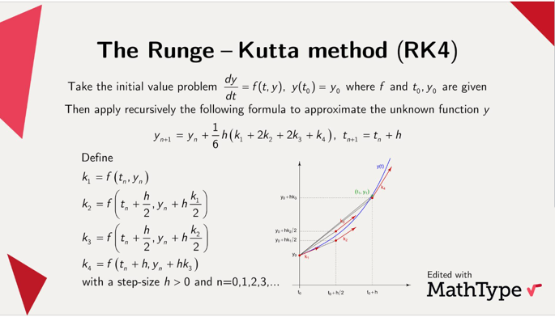

# movement-physics-system

A 2D gravitational N-body simulation with interactive UI, built with Java 25 + Swing. Click or click-and-drag on the canvas to spawn bodies that gravitationally interact with each other.

## Features

- **Gravitational N-body physics** — every body exerts mutual Newtonian gravity on every other body
- **RK4 integration** — 4th-order Runge-Kutta with 24 substeps per frame for numerical stability
- **Interactive spawning** — click to place a body with random initial velocity, or click-and-drag to aim (slingshot-style)
- **Visual trails** — per-body circular-ring trails with configurable length (600 points)
- **Glow effect** — semi-transparent outer halo around each body
- **Drag overlay** — dashed arrow previewing launch velocity, color-coded green→red by speed
- **Body info panel** — click any body to see its mass, velocity, and acceleration in a styled overlay
- **GC-free simulation** — RK4 substep buffers are pre-allocated and grown exponentially, avoiding allocation during the simulation loop
- **Thread-safe architecture** — physics runs on a dedicated daemon thread; rendering on the EDT via Swing Timer

## How to Play

| Action | Effect |
|---|---|
| **Click** empty space | Spawn a body with random mass (40–120) and random initial velocity |
| **Click and drag** | Aim the launch — drag direction and distance set velocity vector |

### Controls Reference

- Bodies are launched with an initial speed in the range `[0.5, 1.5]` (random) when clicking, or scaled from the drag distance when dragging (capped at 12.0)
- Spawn velocity is computed as `dragDelta * 0.025`, clamped to `MAX_DRAG_SPEED`
- Larger bodies have greater mass and appear bigger on screen
- The drag arrow color encodes speed: green (slow) → yellow → red (fast)

## Architecture

```
Application
  ├── JFrame (800×800, fixed size)
  │   └── PanelRenderer (JPanel)
  │       ├── BodyMovementCalculator  (physics state + queries)
  │       ├── SimulationRenderer      (BufferedImage canvas + trails)
  │       ├── DragController          (mouse → Body creation)
  │       ├── DragOverlayRenderer     (drag preview arrow)
  │       └── BodyInfoPanel           (selected body info overlay)
  ├── PhysicsLoop (daemon thread)
  │   └── BodyMovementCalculator.calculateTimeStep(dt)
  └── Swing Timer (60 fps, EDT)
      └── PanelRenderer.renderToCanvas() + repaint()
```

### Package Layout

| Package | Classes | Purpose |
|---|---|---|
| `com.example` | `Application` | Entry point — wires everything together |
| `com.example.config` | `PhysicsConfig`, `RenderConfig` | Tunable constants (gravity, timestep, canvas size, visual params) |
| `com.example.physics` | `Body`, `BodySnapshot`, `BodyMovementCalculator`, `BodyFactory`, `PhysicsLoop`, `RK4Buffers` | Physics simulation, state management, body creation |
| `com.example.render` | `SimulationRenderer`, `Trail`, `DragOverlayRenderer`, `BodyInfoPanel` | Canvas rendering, trails, visual overlays |
| `com.example.ui` | `PanelRenderer`, `DragController`, `DragState` | Swing component, mouse interaction |

## Physics Engine

### Integrator: RK4

The **4th-order Runge-Kutta method (RK4)** is one of the most widely used numerical methods for approximating solutions to differential equations when no exact solution is available. Instead of relying on a single slope, it combines four carefully weighted slope estimates to better capture how the solution curves between steps, achieving a strong balance between accuracy and computational efficiency. This is why RK4 has become a standard tool in numerical analysis, widely used in physics, engineering, and simulations of dynamic systems.


**Why the weights (1, 2, 2, 1)?**

The update formula `y(t + h) = y(t) + (h / 6) · (k₁ + 2k₂ + 2k₃ + k₄)` is equivalent to applying **Simpson's rule** for numerical integration to the derivative over the interval `[t, t + h]`. The two middle slopes at the midpoint (`k₂`, `k₃`) are weighted twice as heavily because they are closer to the true slope at the center of the interval.

**How each slope is computed:**

```
k1 = f(t,            y)            → slope at the start of the interval
k2 = f(t + h/2,  y + (h/2)·k1)     → slope at midpoint, using k1 to predict
k3 = f(t + h/2,  y + (h/2)·k2)     → slope at midpoint, using k2 to predict
k4 = f(t + h,      y + h·k3)       → slope at the end, using k3 to predict
```

- **k₁** is the Euler-style slope at the beginning of the step.
- **k₂** predicts the state at the midpoint using k₁, then evaluates the derivative there.
- **k₃** refines the midpoint prediction using k₂ (a better estimate than k₁).
- **k₄** predicts the state at the end of the step using k₃, capturing how the derivative changes over the full interval.

This cascade of predictions means RK4 matches the Taylor series up to and including the h⁴ term — without ever computing an analytical derivative.

**Application to N-body physics:**

The state of body *i* is the 4-vector `y_i = (x_i, y_i, vx_i, vy_i)`. Newton's second law gives:

```
dx_i/dt  = vx_i
dy_i/dt  = vy_i
dvx_i/dt = a_x(x, y)    // gravitational acceleration from all other bodies
dvy_i/dt = a_y(x, y)
```

RK4 advances by step size `h`:

```
k1 = f(t,          y)
k2 = f(t + h/2,    y + (h/2) * k1)
k3 = f(t + h/2,    y + (h/2) * k2)
k4 = f(t + h,      y + h     * k3)

y(t + h) = y(t) + (h / 6) * (k1 + 2*k2 + 2*k3 + k4)
```

### Gravitational Force

Newton's law of universal gravitation, component-wise (2D):

```
a_x_i = G * Σ_j m_j * (x_j - x_i) / r_ij³
a_y_i = G * Σ_j m_j * (y_j - y_i) / r_ij³
where r_ij = √((x_j - x_i)² + (y_j - y_i)²)
```

- **Plummer softening**: `r²` is clamped to `MIN_DIST_SQ = 144` to prevent singularities when bodies approach each other. Equivalent to the softened potential `U = -G·m_i·m_j / √(r² + ε²)`.
- **Newton's third law**: Each pair `(i, j)` is visited once. The equal-and-opposite contribution is added to both bodies simultaneously, halving the computation: **O(n²/2)**.
- **invR³ optimization**: `1 / (r² · √r²)` is computed once per pair, avoiding a separate division.

### Time Stepping

```
DT       = 0.05        # total simulation time per frame
SUBSTEPS = 24           # substeps per frame
subDt    = DT / SUBSTEPS ≈ 0.002083
```

The physics thread runs a tight loop: 24 RK4 substeps, then `Thread.sleep` to sync to ~60fps. Timing uses `System.nanoTime()` with a periodic resync to prevent drift.

### Culling

Bodies that drift beyond `CULL_MARGIN = 4000` pixels outside the world bounds are automatically removed to keep the simulation manageable.

## Performance

| Technique | Detail |
|---|---|
| **GC-free RK4 buffers** | `RK4Buffers` pre-allocates 16 arrays (positions, velocities, 4 sets of k-values, trial-state temporaries) and grows them exponentially (`cap *= 2`). No allocation happens during the simulation loop. |
| **O(n²/2) gravity** | Newton's third law halves the pair loop. For 30 bodies: ~435 pair evaluations per substep, ~10K per frame. |
| **invR³ per pair** | One `Math.sqrt` and one division per pair instead of two separate distance computations. |
| **Double-buffered canvas** | Off-screen `BufferedImage` is composited every frame, then blitted to the Swing component in a single operation. |
| **Fade-to-black trails** | Each frame, a semi-transparent black rectangle (`alpha=25`) is drawn over the canvas, creating natural trail fade without per-point management. |
| **Circular trail buffer** | Each body's trail is a fixed-capacity ring buffer (600 points). No resizing, no GC pressure. |

## Configuration

All tunables live in two config classes:

### PhysicsConfig

| Constant | Value | Description |
|---|---|---|
| `G` | 60.0 | Gravitational constant |
| `DT` | 0.05 | Simulation time per frame |
| `MIN_DIST` | 12.0 | Plummer softening length |
| `MIN_DIST_SQ` | 144 | Softening length squared |
| `SUBSTEPS` | 24 | RK4 substeps per frame |
| `CULL_MARGIN` | 4000.0 | Distance beyond world bounds for culling |
| `SPAWN_SPEED` | 1.0 | Base random spawn speed |
| `SPAWN_MASS_MIN` | 40.0 | Minimum spawn mass |
| `SPAWN_MASS_MAX` | 120.0 | Maximum spawn mass |

### RenderConfig

| Constant | Value | Description |
|---|---|---|
| `WIDTH` / `HEIGHT` | 800 | Canvas dimensions |
| `TRAIL_LENGTH` | 600 | Max trail points per body |
| `FADE_ALPHA` | 25 | Fade overlay alpha (lower = longer trails) |
| `TRAIL_STROKE` | 2f | Trail line width |
| `BODY_GLOW_ALPHA` | 60 | Halo opacity |
| `BODY_GLOW_PADDING` | 6 | Halo radius extension |
| `REDRAW_INTERVAL_MS` | 16 | Swing Timer interval (~60 fps) |
| `DRAG_VELOCITY_SCALE` | 0.025 | Pixels-to-velocity conversion factor |
| `MAX_DRAG_SPEED` | 12.0 | Capped launch speed |
| `CLICK_DRAG_THRESHOLD` | 4 | Pixels — below this, treated as a click |
| `DRAG_ARROW_HEAD` | 8 | Arrowhead length |
| `DRAG_DASH` | 6f | Dashed line dash segment length |

## Threading Model

```
EDT (Event Dispatch Thread)          Physics Daemon Thread
─────────────────────────           ─────────────────────
Swing Timer (60fps)                  PhysicsLoop.run()
  ├─ PanelRenderer.renderToCanvas()    ├─ for 24 substeps:
  ├─ PanelRenderer.repaint()           │   sim.calculateTimeStep(subDt)
Mouse events                           ├─ Thread.sleep → ~60fps
  ├─ DragController.mousePressed
  ├─ DragController.mouseDragged      BodyMovementCalculator
  ├─ DragController.mouseReleased     (synchronized simLock)
  └─ PanelRenderer.mouseClicked
                                       snapshot() → BodySnapshot[]
                                       selectBodyAt() → id + acceleration
                                       getBodySnapshotById() → BodySnapshot
                                       getBodyAcceleration() → double[2]
```

- **`BodyMovementCalculator`** protects all mutable state with a single `synchronized (simLock)` block.
- **`BodySnapshot`** is an immutable `record` that captures a point-in-time view of a `Body`'s state. It is the sole data transfer object between the physics and rendering threads.
- **`DragState`** is an immutable record; `DragController` publishes it via a `volatile` reference, guaranteeing a consistent point-in-time read.
- **`Trail`** is NOT thread-safe and is only accessed from the rendering thread (via `SimulationRenderer`).

## Data Flow

```
User click/drag
    → DragController creates Body (via BodyFactory)
    → sim.addBody(body) [acquires simLock]

Physics thread (every substep):
    BodyMovementCalculator.calculateTimeStep(subDt)
        1. Copy body state into RK4Buffers (GC-free)
        2. k1: compute accelerations at current state
        3. k2: trial state at t + subDt/2 using k1 → compute accelerations
        4. k3: trial state at t + subDt/2 using k2 → compute accelerations
        5. k4: trial state at t + subDt using k3 → compute accelerations
        6. Combine: y_new = y + (subDt/6) * (k1 + 2*k2 + 2*k3 + k4)
        7. Write k1 accelerations back to Body.ax / Body.ay
        8. Cull bodies outside world bounds

Rendering thread (every 16ms):
    SimulationRenderer.renderToCanvas(sim)
        1. Fade overlay (semi-transparent black)
        2. Snapshot bodies [acquires simLock]
        3. Push current positions into per-body Trail ring buffers
        4. Draw trails (colored line segments, oldest→newest)
        5. Draw bodies (glow halo + solid circle, radius = √mass * 2)
    PanelRenderer.repaint()
        1. Blit canvas to screen
        2. Draw BodyInfoPanel if a body is selected
        3. Draw DragOverlayRenderer if dragging
```

## Build & Run

**Requirements**: Java 25+ (JDK), Maven 3.6+

```bash
mvn compile
mvn -q exec:java -Dexec.mainClass="com.example.Application"
```

Or run from your IDE by launching `com.example.Application`.

## Design Notes

### Why RK4 over Verlet or Leapfrog?

RK4 provides smooth, isotropic integration without the directional bias of symplectic Euler. For a visual simulation where bodies move in curved orbital paths, the O(h⁴) global error produces more natural-looking trajectories at the substep budget used here.

### Why not parallelize gravity?

The current code is already CPU-bound on the math itself — the pair loop in `calculateAccelerations` dominates. The substep budget (24) already trades CPU for accuracy, and reducing it would hurt trajectory quality more than threading would help. For 20–30 bodies (where the simulation visually saturates), a single thread handles ~10K pair evaluations per frame with room to spare.

### Why BodySnapshot instead of locking during render?

Holding `simLock` during rendering would block the physics thread for 16ms per frame, causing timestep jitter. Instead, the rendering thread takes a quick snapshot (copying a few doubles per body) and works on its own copy. The trade-off is a small window of visual lag (one frame at 60fps ≈ 16ms), which is imperceptible.
